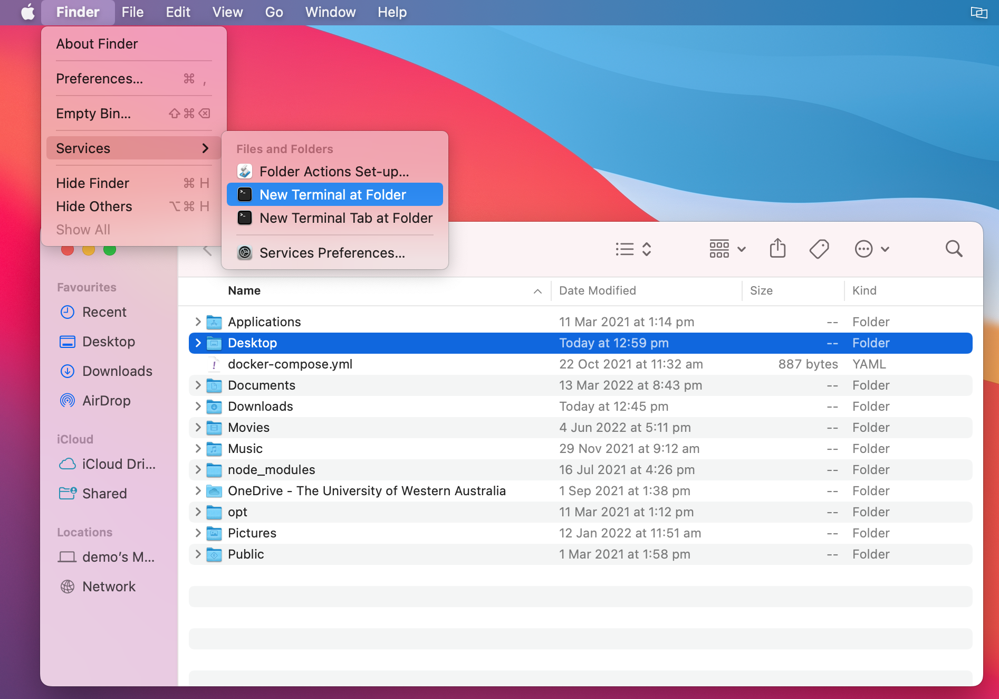
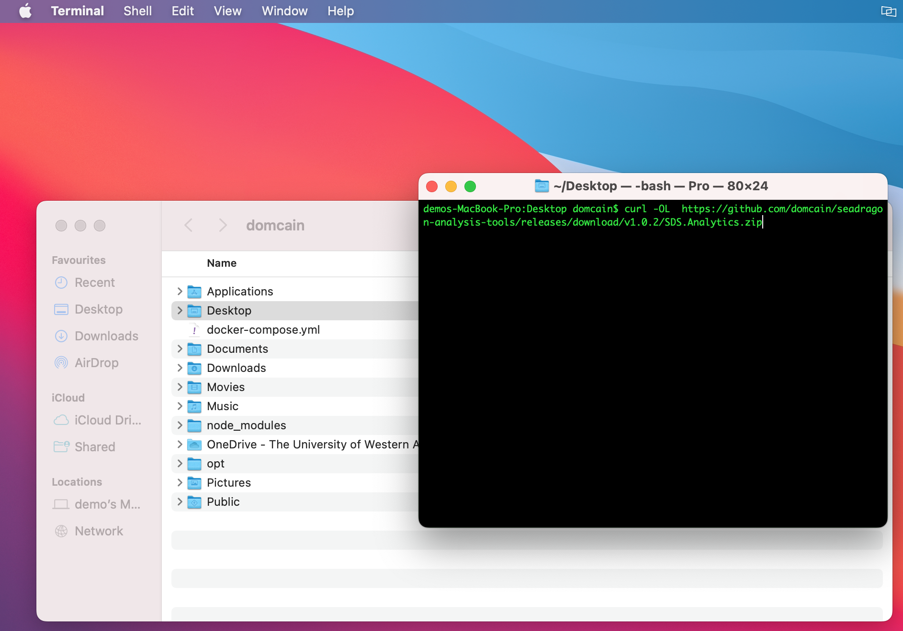
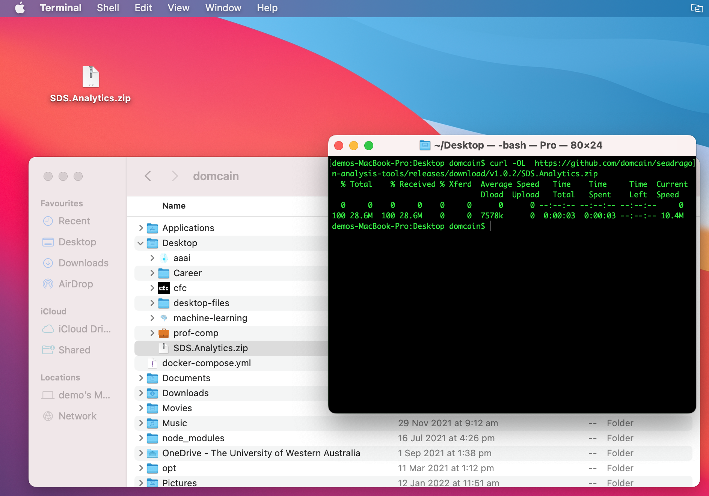
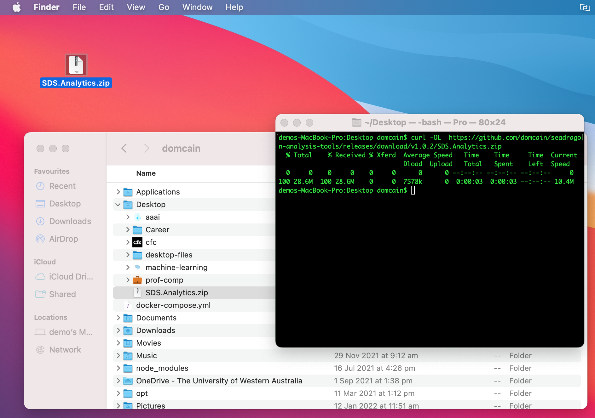
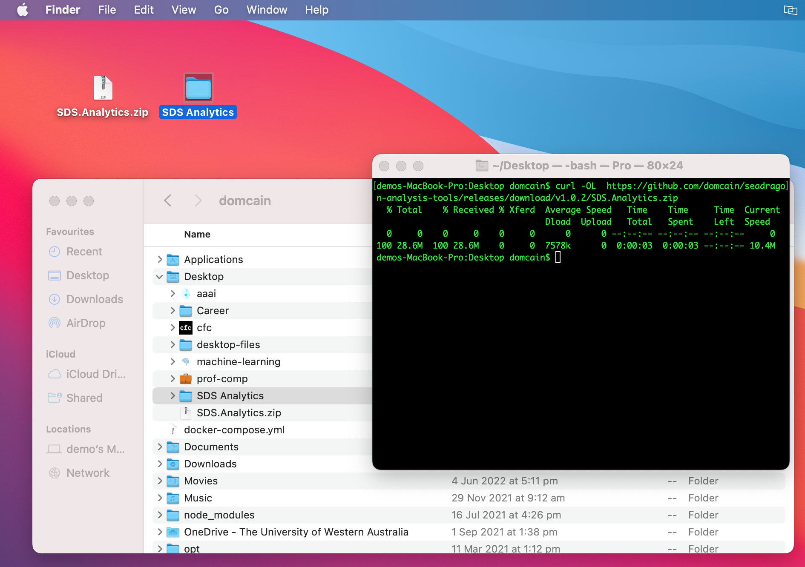
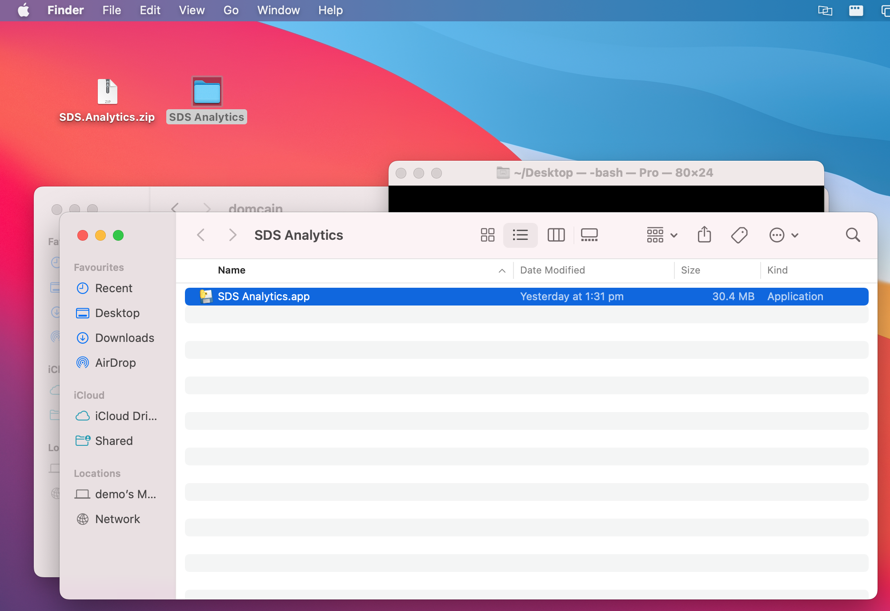

# Installation Guide
1. On your **MacOS** computer using the **Finder**, **select the folder** (clicking only once, so it appears blue) you wish to download the application to. 
2. Once the folder is selected, click **Finder**, choose **Services** > **New Terminal at Folder** (Located next to the Apple menu  in the corner of your screen).
{: align=center  }

3. To download the project, **copy the following command**:
```
curl -OL  https://github.com/domcain/seadragon-analysis-tools/releases/download/v1.0.2/SDS.Analytics.zip
```
4. **Paste the command** into your command-line. 
??? note "What does this do?"
    This accesses [the website where the code is located](https://github.com/domcain/seadragon-analysis-tools/releases) and downloads the application. Performing this manually will result in bugs related to security interference from GitHub
{: align=center  }
5. **Click enter** *if* the command has not already started.


You should now have a file called `SDS.Analytics.zip` in your chosen directory.
{: align=center }
6. **Unzip** the `SDS.Analytics.zip` folder by double clicking on it with your mouse.
{: align=center }
{: align=center }
8. **Open** the `SDS Analytics` folder.
    
- You should be able to see the application as `SDS Analytics.app`, and also run it by double clicking on it.
{: align=center }
??? note "Want to store the application elsewhere?"
    **Go for it!** The application can be run from anywhere on your computer!
    
