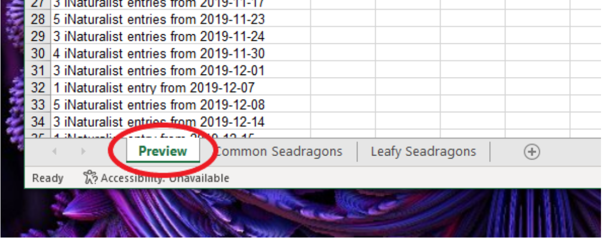

# User Manual
## Upload SeadragonSearch file

A maximum of 1 SeadragonSearch file can be uploaded at a time. The file needs to be an excel file. You can upload the file in two ways:

1. **‘Click to browse’**
    
    1. **Click** the SeadragonSearch upload box
    2. **Select** the SeadragonSearch excel file from the file explorer pop up.

    {: align=right  }

2. **‘Drag & drop’**
    
    From a separate file explorer window, **drag the SeadragonSearch excel file into the SeadragonSearch upload box**
    {: align=center  }

## Upload iNaturalist file(s)

A maximum of 3 iNaturalist files can be uploaded at a time. This is to accommodate the Common, Leafy and Ruby Seadragon species data being stored in separate files. **Upload these files in any order**. iNaturalist files must be csv files. Supported extensions are **.csv** and **.txt**.
Again, you can upload the file in two ways:
    
1. **‘Click to browse’**
    1. **Click** the iNaturalist upload box
    2. **Select up to 3 iNaturalist .csv files** from the file explorer pop up
        {: align=center  }
2. **‘Drag & drop’**
    1. From a separate file explorer window, **drag up to 3 iNaturalist .csv files** into the iNaturalist upload box
    {: align=right  }
## Removing files
To remove any uploaded file: 
    
1. **Click the ‘x’** button next to the path of the file you wish to remove.
{: align=center  }
## Analysing the files
Once you are satisfied you have uploaded the files you wish to analyse, **click ‘Submit’**.
??? note 
    The ‘Submit’ button will only be enabled when **at least 1 file** has been uploaded **for both SeadragonSearch and iNaturalist**.
{: align=center  }

Clicking ‘Submit’ will bring up a pop up window containing a preview of the results of the analysis.
!!! note 
    If you wish to download the full details of the results, **click ‘Download Results’**. 
{: align=center  }
From the file explorer pop up, you can navigate to where you would like the results file to be downloaded, as well as rename the file to something of your choice. 

## Interpreting the results file
The results file will be an Excel (.xls) document. The first worksheet in the file is a copy of the preview that was provided when the results file was generated. 
{: align=center  }
Each subsequent worksheet in the file corresponds to a specific iNaturalist file which was uploaded. For example, if you uploaded an iNaturalist file for both Common and Leafy Seadragons, the results file will have a worksheet for each of these species, as in the example below.
{: align=center  }
These worksheets are copies of the iNaturalist files which were uploaded for analysis, with highlighted rows to indicate entries that may be missing from the SeadragonSearch database. Each highlighted entry should be reviewed by a human before being added to the SeadragonSearch database.

