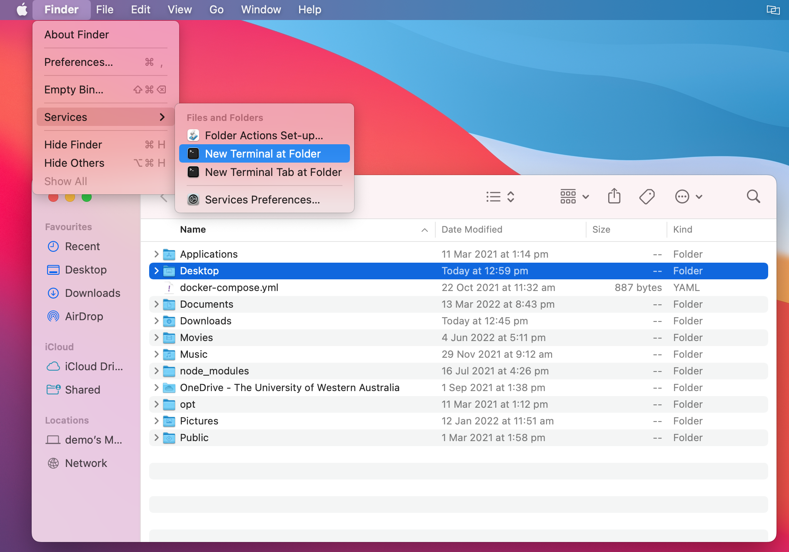
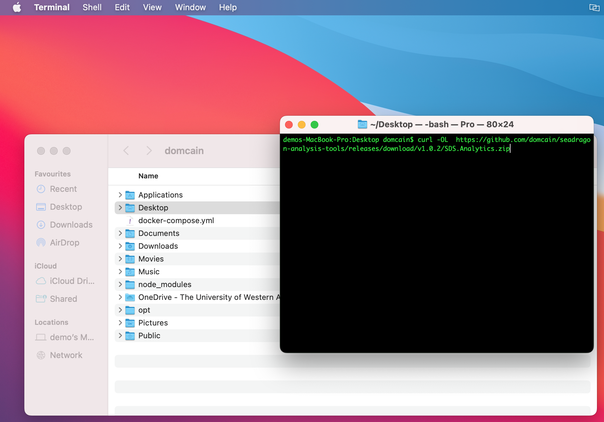

# Overview
# Installation Guide
1. On your **MacOS** computer, use the **Finder** to **select the folder** you wish to download the application to. 
2. Once the folder is selected, click **Finder**, choose **Services** > **New Terminal at Folder** (Located next to the Apple menu  in the corner of your screen).
{: align=right }

3. To download the project, **copy the following command**:
```
curl -OL  https://github.com/domcain/seadragon-analysis-tools/releases/download/v1.0.2/SDS.Analytics.zip
```
4. **Paste the command** into your command-line. 
{: align=right }
5. **Click enter** *if* the command has not already started.

6. 

??? note "does this look dodgy?"
    Of course this looks dodgy! Do it.

# User Manual

Upload SeadragonSearch file
A maximum of 1 SeadragonSearch file can be uploaded at a time. The file needs to be an excel file.
You can upload the file in two ways:
‘Click to browse’
Click the SeadragonSearch upload box
Select the SeadragonSearch excel file from the file explorer pop up


Clicking  SDS window  —-> 


‘Drag & drop’
From a separate file explorer window, drag the SeadragonSearch excel file into the SeadragonSearch upload box


Upload iNaturalist file(s)
A maximum of 3 iNaturalist files can be uploaded at a time. This is to accommodate the Common, Leafy and Ruby Seadragon species data being stored in separate files. Upload these files in any order. iNaturalist files must be csv files. Supported extensions are .csv and .txt.
Again, you can upload the file in two ways:
‘Click to browse’
Click the iNaturalist upload box
Select up to 3 iNaturalist csv files from the file explorer pop up
		


Click on iNat window —->


‘Drag & drop’
From a separate file explorer window, drag up to 3 iNaturalist csv files into the iNaturalist upload box

Removing files
To remove any uploaded file, click the ‘x’ button next to the path of the file you wish to remove.


Analysing the files
Once you are satisfied you have uploaded the files you wish to analyse, click ‘Submit’.
This will bring up a pop up window containing a preview of the results of the analysis.
If you wish to download the full details of the results, click ‘Download Results’. From the file explorer pop up, you can navigate to where you would like the results file to be downloaded, as well as rename the file to something of your choice. 
Interpreting the results file
The results file will be an Excel (.xls) document. The first worksheet in the file is a copy of the preview that was provided when the results file was generated. Each subsequent worksheet in the file corresponds to a specific iNaturalist file. The highlighted rows are entries that may be missing from the SeadragonSearch database. Each highlighted entry should be reviewed by a human before being added to the SeadragonSearch database.


